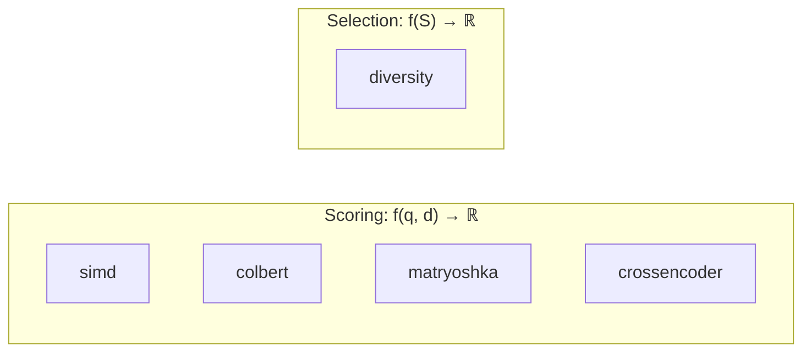

# Design

## Dependencies

**Zero by default.** One optional.

| Config | Deps | Compile | Binary |
|--------|------|---------|--------|
| Default | 0 | ~0.2s | ~50KB |
| `hierarchical` | kodama | ~0.5s | ~80KB |

Why minimal: SIMD is hand-written. No linear algebra crate needed.

## Problem Space

Two distinct problems:



| Problem | Function | Module |
|---------|----------|--------|
| **Scoring** | $f(\text{query}, \text{doc}) \to \mathbb{R}$ | simd, colbert, matryoshka, crossencoder |
| **Selection** | $f(\text{set}) \to \mathbb{R}$ | diversity |

## Scoring Paradigms

### Dense Scoring

Single embedding per document:

```math
\text{score}(q, d) = \frac{q \cdot d}{\|q\| \|d\|}
```

**Complexity:** $O(d)$ where $d$ is embedding dimension.

### Late Interaction (MaxSim)

Per-token embeddings. For each query token, find best matching doc token:

```math
\text{MaxSim}(Q, D) = \sum_{i=1}^{|Q|} \max_{j=1}^{|D|} (q_i \cdot d_j)
```

**Complexity:** $O(|Q| \cdot |D| \cdot d)$

**Why better:** Captures token-level semantics that single vectors lose. "Capital of France" matches documents where "capital" and "France" co-occur with high similarity, not just documents about capitals in general.

### Cross-encoder

Full transformer attention over concatenated query+document:

```math
\text{score}(q, d) = \text{Model}([q; d])
```

**Complexity:** $O(n)$ inference per pair.

**Why better:** Full cross-attention, not just embedding comparison. ~5x better than dense on MS MARCO (Nogueira & Cho, 2019).

## Diversity Selection

### The Problem

Top-k by relevance often returns near-duplicates. Users want variety.

### Submodular Structure

Diversity selection is **submodular**: adding an item has diminishing returns.

```math
f(S \cup \{x\}) - f(S) \leq f(T \cup \{x\}) - f(T) \quad \text{for } T \subseteq S
```

If you've already selected similar items, a new item adds less marginal value.

### MMR (Maximal Marginal Relevance)

Balances relevance and diversity:

```math
\text{MMR} = \arg\max_{d \in R \setminus S} \left[ \lambda \cdot \text{rel}(d) - (1-\lambda) \cdot \max_{s \in S} \text{sim}(d, s) \right]
```

- $\lambda = 1$: pure relevance (top-k)
- $\lambda = 0.5$: balanced
- $\lambda = 0$: maximum diversity

**Complexity:** $O(k \cdot n)$ where $k$ is output size, $n$ is candidate size.

**Greedy approximation:** MMR is greedy, not optimal. But greedy submodular maximization has a $(1 - 1/e) \approx 0.63$ approximation guarantee (Nemhauser et al., 1978).

## SIMD Implementation

Hand-written intrinsics, auto-dispatch at runtime:

| Platform | Features | Vectors |
|----------|----------|---------|
| x86_64 | AVX2 + FMA | 256-bit (8 floats) |
| x86_64 | SSE4.1 | 128-bit (4 floats) |
| aarch64 | NEON | 128-bit (4 floats) |
| other | — | Scalar |

**Threshold:** SIMD only for dimension ≥ 16. Below that, loop overhead exceeds benefit.

**Why not ndarray/nalgebra?**
- Would add ~50 transitive deps
- We only need dot/cosine/maxsim
- Hand-written is ~10 lines per function

## Token Pooling

ColBERT stores $|D|$ embeddings per document. Pooling reduces to $|D|/k$:

| Factor | Storage | Quality Loss |
|--------|---------|--------------|
| 2x | 50% | ~0% |
| 3x | 33% | ~1% |
| 4x | 25% | 2-5% |
| 8x | 12.5% | 5-10% |

From Clavié et al. (2024). Quality loss measured on MS MARCO and BEIR.

**Methods:**
- `pool_tokens`: Greedy agglomerative, $O(n^3 d)$
- `pool_tokens_hierarchical`: Ward's method via kodama, $O(n^2 \log n)$, better quality for factor 4+

**Protected tokens:** Special tokens ([CLS], [D], [Q]) should not be pooled. Use `pool_tokens_with_protected`.

**Key insight:** Pooling is index-time only. Queries stay full resolution.

## Why One Crate?

We considered `rank-select` for diversity. Arguments against:

1. **Shared code:** MMR uses `cosine` from simd module
2. **Pipeline:** Users score → diversify in sequence
3. **Size:** MMR is ~150 lines

Mathematical distinction is documented, but practical separation isn't justified.

## Alternatives Considered

**Why not bundle inference?**
- Would require ONNX/candle/etc. — heavy deps
- Users have preferred runtimes
- BYOM is more flexible

**Why not use faiss-rs or qdrant's SIMD?**
- faiss-rs requires C++ toolchain
- qdrant is server-focused
- We want minimal, embeddable library

## References

### Scoring
- Khattab & Zaharia (2020). [ColBERT](https://arxiv.org/abs/2004.12832)
- Santhanam et al. (2022). [ColBERTv2](https://arxiv.org/abs/2112.01488) — residual compression
- Nogueira & Cho (2019). [BERT for Passage Reranking](https://arxiv.org/abs/1901.04085)
- Kusupati et al. (2022). [Matryoshka Embeddings](https://arxiv.org/abs/2205.13147)
- Li et al. (2024). [2D Matryoshka Embeddings](https://arxiv.org/abs/2402.14776) — layer+dim truncation

### Diversity
- Carbonell & Goldstein (1998). [MMR](https://dl.acm.org/doi/10.1145/290941.291025)
- Nemhauser et al. (1978). [Submodular Maximization](https://link.springer.com/article/10.1007/BF01588971)

### Token Pooling
- Clavié et al. (2024). [Token Pooling for ColBERT](https://arxiv.org/abs/2409.14683)
