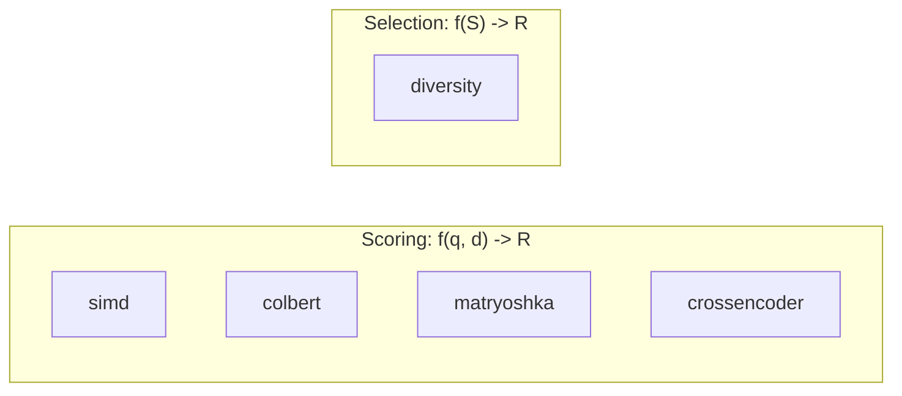

# Design

## Dependencies

**Zero by default.** One optional.

| Config | Deps | Compile | Binary |
|--------|------|---------|--------|
| Default | 0 | ~0.2s | ~50KB |
| `hierarchical` | kodama | ~0.5s | ~80KB |

Why minimal: SIMD is hand-written. No linear algebra crate needed.

## Problem Space

This crate solves two distinct problems:

1. **Scoring**: Given a query and a document, how similar are they?
2. **Selection**: Given a set of scored documents, which subset maximizes utility?



| Problem | Function | Module |
|---------|----------|--------|
| **Scoring** | `f(query, doc) -> score` | simd, colbert, matryoshka, crossencoder |
| **Selection** | `f(candidate_set) -> subset` | diversity |

## Scoring Paradigms

### The Retrieval-Reranking Gap (2019)

Before ColBERT, there was a frustrating dichotomy in neural IR:

**Bi-encoders (dense)**: Encode query and document independently. Fast (ANN search works), but compresses everything into one vector, losing fine-grained alignment.

**Cross-encoders**: Run a full transformer over concatenated query+document. Slower (can't pre-compute), but sees query-document interactions directly. About 5x better MRR@10 on MS MARCO (Nogueira & Cho, 2019).

The practical gap: cross-encoders are too slow for first-stage retrieval over millions of docs, bi-encoders aren't precise enough for final ranking.

### Dense Scoring

Single embedding per document. The intuition: compress all semantic meaning into one vector, then measure alignment via cosine similarity.

$$\text{score}(q, d) = \frac{q \cdot d}{\|q\| \|d\|}$$

**Complexity:** $O(d)$ where $d$ is embedding dimension.

**Example:** Query `[0.8, 0.6]` and doc `[0.6, 0.8]`:
- Dot product: $0.8 \times 0.6 + 0.6 \times 0.8 = 0.96$
- Norms: $\sqrt{0.8^2 + 0.6^2} = 1.0$ for both
- Cosine: $0.96 / (1.0 \times 1.0) = 0.96$

### Late Interaction: A Middle Path (2020)

Khattab & Zaharia's ColBERT introduced late interaction: keep one vector per token, but defer the interaction to query time. This achieves:

- **Pre-computation**: Document tokens can be indexed offline
- **Fine-grained matching**: Token-level alignment, not just bag-of-words
- **Scalability**: MaxSim over pre-indexed tokens is much faster than cross-encoder inference

The key insight: the expensive transformer computation happens during encoding. The "interaction" (MaxSim) is just dot products—cheap and parallelizable.

### Late Interaction (MaxSim)

Per-token embeddings. The intuition: instead of forcing all meaning into one vector, keep one vector per token and let them "talk" to each other at query time.

For each query token, find its best-matching document token, then sum:

$$\text{MaxSim}(Q, D) = \sum_{i=1}^{|Q|} \max_{j=1}^{|D|} (q_i \cdot d_j)$$

**Complexity:** $O(|Q| \cdot |D| \cdot d)$

**Example:** Query has 2 tokens, doc has 3 tokens (2D embeddings for simplicity):

```
Q = [[1, 0],    # "capital"
     [0, 1]]    # "France"

D = [[0.9, 0.1], # "Paris"
     [0.1, 0.8], # "French"
     [0.5, 0.5]] # "city"
```

For query token `[1, 0]` ("capital"):
- vs "Paris": $1 \times 0.9 + 0 \times 0.1 = 0.9$
- vs "French": $1 \times 0.1 + 0 \times 0.8 = 0.1$
- vs "city": $1 \times 0.5 + 0 \times 0.5 = 0.5$
- **max = 0.9** (matched "Paris")

For query token `[0, 1]` ("France"):
- vs "Paris": $0 \times 0.9 + 1 \times 0.1 = 0.1$
- vs "French": $0 \times 0.1 + 1 \times 0.8 = 0.8$
- vs "city": $0 \times 0.5 + 1 \times 0.5 = 0.5$
- **max = 0.8** (matched "French")

**MaxSim = 0.9 + 0.8 = 1.7**

**Why better:** Captures token-level semantics that single vectors lose. "Capital of France" matches documents where "capital" and "France" both have strong matches, even in different parts of the document.

**When NOT to use:**
- ❌ First-stage retrieval over millions of docs (too slow, use dense + ANN)
- ❌ Very short documents (<10 tokens, little benefit over dense)
- ❌ Storage-constrained without pooling (10-100x larger than dense)
- ❌ Queries with many stopwords (MaxSim sums all tokens, including noise)

### Cross-encoder

Full transformer attention over concatenated query+document:

$$\text{score}(q, d) = \text{Model}(\texttt{[CLS]} \oplus q \oplus \texttt{[SEP]} \oplus d)$$

**Complexity:** $O((|q| + |d|)^2)$ due to self-attention over the concatenated sequence.

**Why better:** The model sees query and document tokens *together*, allowing direct cross-attention. Bi-encoders (dense) encode query and doc separately, losing this interaction. Cross-encoders achieve ~5x better MRR@10 than dense on MS MARCO (Nogueira & Cho, 2019).

**Trade-off:** Cannot pre-compute document embeddings. Must run inference for every (query, doc) pair at query time. Use as a second-stage reranker over a small candidate set (typically 100-1000 docs).

**When to use:** Final reranking stage when latency allows (~10ms per query-doc pair). Not suitable for first-stage retrieval.

## Diversity Selection

### The Problem

Top-k by relevance often returns near-duplicates. Search "async programming" and you might get 10 Python asyncio tutorials when users want to see Python, Rust, JavaScript, and Go examples.

### Submodular Structure

Diversity selection is **submodular**: adding an item has diminishing returns.

$$f(S \cup \{x\}) - f(S) \leq f(T \cup \{x\}) - f(T) \quad \text{for } T \subseteq S$$

Intuition: If you've already selected 5 Python articles, adding a 6th Python article helps less than if you only had 2. This diminishing returns property is key to efficient optimization.

### Algorithms

| Algorithm | Complexity | When to Use |
|-----------|------------|-------------|
| **MMR** | $O(k \cdot n)$ | General use, simple, fast |
| **DPP** | $O(k \cdot n \cdot d)$ | Better theoretical diversity, small k |

### MMR (Maximal Marginal Relevance)

Balances relevance and diversity via a simple trade-off parameter:

$$\text{MMR} = \arg\max_{d \in R \setminus S} \left[ \lambda \cdot \text{rel}(d) - (1-\lambda) \cdot \max_{s \in S} \text{sim}(d, s) \right]$$

- $\lambda = 1$: pure relevance (equivalent to top-k)
- $\lambda = 0.5$: balanced (common default)
- $\lambda = 0$: maximum diversity (ignore relevance)

**Example:** Three candidates after first-stage retrieval:

| Doc | Relevance | Sim to Selected |
|-----|-----------|-----------------|
| A (Python asyncio) | 0.95 | - |
| B (Python coroutines) | 0.90 | 0.9 to A |
| C (Rust async) | 0.80 | 0.2 to A |

With $\lambda = 0.5$, after selecting A:
- MMR(B) = $0.5 \times 0.90 - 0.5 \times 0.9 = 0.45 - 0.45 = 0.0$
- MMR(C) = $0.5 \times 0.80 - 0.5 \times 0.2 = 0.40 - 0.10 = 0.3$

**C wins** despite lower relevance, because it's more diverse.

**Approximation guarantee:** Greedy submodular maximization achieves $(1 - 1/e) \approx 0.63$ of optimal (Nemhauser et al., 1978).

### DPP (Determinantal Point Process)

Models joint diversity via matrix determinants:

$$P(S) \propto \det(L_S)$$

where $L$ is a kernel matrix combining quality and similarity.

**Intuition:** The determinant of a matrix measures the "volume" spanned by its row/column vectors. Orthogonal vectors span more volume than parallel ones. DPP favors sets whose embeddings span a large volume in embedding space, i.e., diverse sets.

**Why DPP over MMR?** MMR penalizes similarity to the **single most similar** selected item. DPP considers **all pairwise** interactions holistically.

Example where DPP beats MMR:
- Items A, B, C where A-B similar, A-C similar, but B-C very different
- MMR might reject both B and C (each too similar to A)
- DPP recognizes {A, B, C} spans good volume because B and C are different

**Greedy DPP:** Exact DPP is NP-hard. We use the standard greedy approximation:
1. Select item maximizing $q_i \cdot \|v_i^\perp\|$ (quality times orthogonal component)
2. Update residuals via Gram-Schmidt-style projection
3. Repeat

**Complexity:** O(k × n × d) where k = items to select, n = candidates, d = embedding dimension.

**Reference:** [k-DPP](https://arxiv.org/abs/1207.6083) (Kulesza & Taskar 2012). The "Fast Greedy MAP" variant (Chen et al. 2018) uses Cholesky updates for O(nk²) but requires more memory; for typical k ≪ n our approach is sufficient.

## SIMD Implementation

Hand-written intrinsics, auto-dispatch at runtime:

| Platform | Features | Vectors |
|----------|----------|---------|
| x86_64 | AVX2 + FMA | 256-bit (8 floats) |
| aarch64 | NEON | 128-bit (4 floats) |
| other | — | Scalar |

Older x86_64 CPUs without AVX2 fall back to scalar. SSE4.1 could be added but most CPUs from 2013+ have AVX2.

**Threshold:** SIMD only for dimension ≥ 16. Below that, loop overhead exceeds benefit.

**Why not ndarray/nalgebra?**
- Would add ~50 transitive deps
- We only need dot/cosine/maxsim
- Hand-written is ~10 lines per function

## Token Pooling

ColBERT stores $|D|$ embeddings per document. For a 100-token document with 128-dim embeddings, that's $100 \times 128 \times 4 = 51$ KB per document. At 10M documents, you need 500 GB just for embeddings.

Pooling reduces storage by clustering similar tokens:

```
Before:  [tok1] [tok2] [tok3] [tok4] [tok5] [tok6]  (6 vectors)
         similar--^       similar------^
After:   [mean(1,2)]  [tok3] [mean(4,5)] [tok6]    (4 vectors = 33% reduction)
```

| Factor | Tokens Kept | MRR@10 Loss | Notes |
|--------|-------------|-------------|-------|
| 2x | 50% | 0.1–0.3% | Safe default |
| 3x | 33% | 0.5–1.0% | Good trade-off |
| 4x | 25% | 1.5–3.0% | Use `hierarchical` feature |
| 8x | 12.5% | 5–10% | Storage-critical only |

From Clavie et al. (2024) on MS MARCO dev. Results vary by document length and query type.

**Methods:**
- `pool_tokens`: Greedy agglomerative, $O(n^3 d)$
- `pool_tokens_hierarchical`: Ward's method via kodama, $O(n^2 \log n)$, better quality at factor 4+

**Protected tokens:** Special tokens ([CLS], [D], [Q]) should not be pooled. Use `pool_tokens_with_protected`.

**Key insight:** Pooling is index-time only. Queries stay full resolution. You compress documents once when indexing, but queries are scored at full fidelity.

## Future Directions

- **Token Importance Weighting**: Learnable per-token weights for MaxSim
- **2D Matryoshka**: Layer + dimension truncation for faster inference
- **Residual Compression**: ColBERTv2-style centroid + residual storage

---

## Historical Context

This section provides additional historical background. See the [Scoring Paradigms](#scoring-paradigms) section above for the main discussion of the retrieval-reranking gap and late interaction.

### The Storage Problem (2021-2024)

ColBERT's effectiveness came with a cost: storing 128 vectors per document instead of 1. For large corpora, this meant terabytes of embeddings.

Three solutions emerged:

1. **Residual compression** (ColBERTv2, 2021): Quantize tokens relative to cluster centroids
2. **Token pruning** (Lassance et al., 2021): Remove uninformative tokens entirely
3. **Token pooling** (Clavie et al., 2024): Cluster similar tokens, store centroids

This crate implements pooling because it's the most flexible: no retraining required, works with any ColBERT-style model.

### Why Matryoshka? (2022)

Fixed-size embeddings create deployment friction. A 768-dim model is overkill for some applications, insufficient for others. Retraining for each use case is expensive.

Kusupati et al. observed that you could train with loss at multiple dimension checkpoints, forcing important information into early dimensions. The result: one model, many effective sizes.

The practical benefit: two-stage retrieval. Search with small embeddings (fast ANN), refine with full embeddings (precise reranking).

### Diversity: An Old Problem, New Urgency (1998-present)

MMR was introduced in 1998 for document summarization. The insight: selecting the "best" items repeatedly gives you redundancy, not utility.

With RAG (retrieval-augmented generation), diversity matters more than ever. Language models benefit from diverse context—5 different perspectives beat 5 paraphrases of the same idea.

DPPs (Determinantal Point Processes) emerged from physics and random matrix theory. Kulesza & Taskar (2012) showed they're natural for ML diversity problems: the determinant of a kernel matrix measures the "volume" spanned by selected items. Orthogonal items span more volume than parallel ones.

### Beyond Text: ColPali and Multimodal (2024-2025)

Late interaction isn't limited to text. ColPali (2024) applies the same idea to document images: encode page patches as tokens, then MaxSim against query tokens. This enables "visual" retrieval without OCR.

The abstraction this crate provides—MaxSim over token embeddings—works regardless of the encoder's modality.

---

## Why One Crate?

We considered `rank-select` for diversity. Arguments against:

1. **Shared code:** MMR uses `cosine` from simd module
2. **Pipeline:** Users score → diversify in sequence
3. **Size:** MMR is ~150 lines

Mathematical distinction is documented, but practical separation isn't justified.

## Alternatives Considered

**Why not bundle inference?**
- Would require ONNX/candle/etc. — heavy deps
- Users have preferred runtimes
- BYOM is more flexible

**Why not use faiss-rs or qdrant's SIMD?**
- faiss-rs requires C++ toolchain
- qdrant is server-focused
- We want minimal, embeddable library

## References

### Scoring
- Khattab & Zaharia (2020). [ColBERT](https://arxiv.org/abs/2004.12832)
- Santhanam et al. (2022). [ColBERTv2](https://arxiv.org/abs/2112.01488) — residual compression
- Nogueira & Cho (2019). [BERT for Passage Reranking](https://arxiv.org/abs/1901.04085)
- Kusupati et al. (2022). [Matryoshka Embeddings](https://arxiv.org/abs/2205.13147)
- Li et al. (2024). [2D Matryoshka Embeddings](https://arxiv.org/abs/2402.14776) — layer+dim truncation
- Archish et al. (2025). [Token Importance Weighting](https://arxiv.org/abs/2511.16106) — weighted MaxSim

### Diversity
- Carbonell & Goldstein (1998). [MMR](https://dl.acm.org/doi/10.1145/290941.291025)
- Gao & Zhang (2024). [VRSD](https://arxiv.org/abs/2407.04573) — lambda-free diversity
- Nemhauser et al. (1978). [Submodular Maximization](https://link.springer.com/article/10.1007/BF01588971)

### Token Pooling
- Clavié et al. (2024). [Token Pooling for ColBERT](https://arxiv.org/abs/2409.14683)
