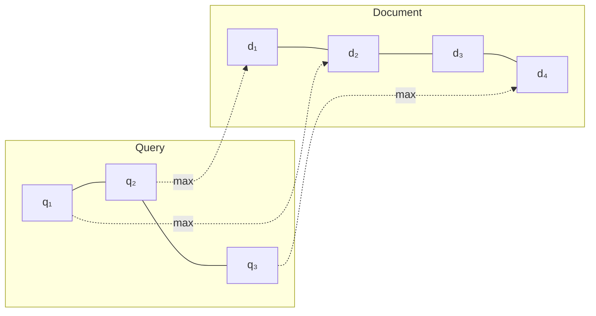
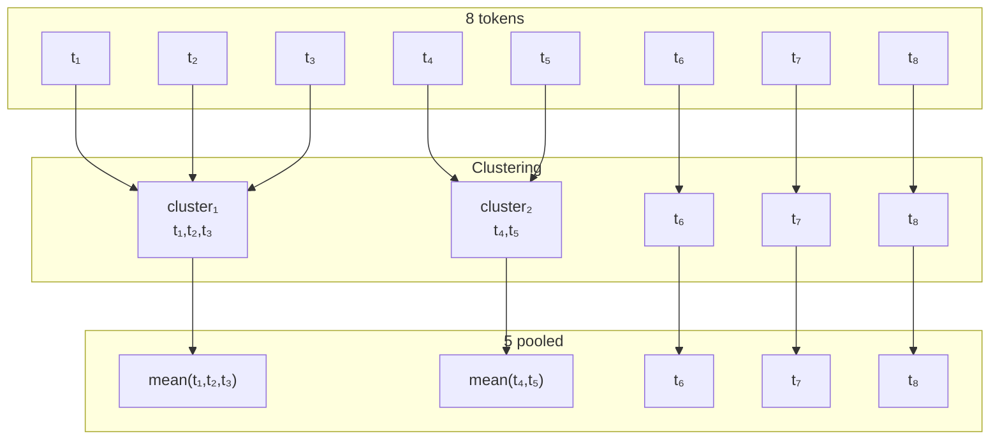
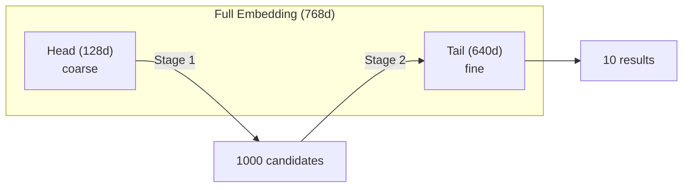
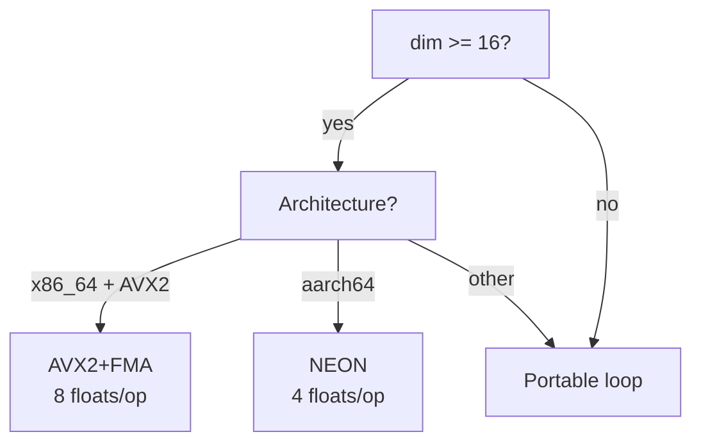

# Technical Reference

Deep technical details for understanding the implementation.
For getting started, see [README.md](README.md).

## Table of Contents

1. [MaxSim Algorithm](#maxsim-algorithm)
2. [Token Pooling](#token-pooling)
3. [Matryoshka Embeddings](#matryoshka-embeddings)
4. [SIMD Implementation](#simd-implementation)
5. [Mathematical Properties](#mathematical-properties)
6. [Glossary](#glossary)
7. [References](#references)

---

## MaxSim Algorithm

### Intuition

Dense retrieval compresses an entire document into one vector. Late interaction
keeps **one vector per token**, preserving fine-grained semantics.



For each query token, find its best-matching document token, then sum.

### Formal Definition

Given query tokens $Q = [q_1, q_2, \ldots, q_m]$ and document tokens $D = [d_1, d_2, \ldots, d_n]$
where each $q_i, d_j \in \mathbb{R}^d$:

$$\text{MaxSim}(Q, D) = \sum_{i=1}^{m} \max_{j \in [1,n]} (q_i \cdot d_j)$$

### Pseudocode

```python
def maxsim(Q, D):
    if len(Q) == 0 or len(D) == 0:
        return 0.0
    total = 0.0
    for q in Q:
        total += max(dot(q, d) for d in D)
    return total
```

### Complexity

- **Time**: $O(m \times n \times d)$
- **Space**: $O(1)$ additional

### Properties

1. **Asymmetric**: $\text{MaxSim}(Q, D) \neq \text{MaxSim}(D, Q)$
2. **Monotonic**: Adding doc tokens cannot decrease score
3. **Permutation invariant**: Token order doesn't affect score

### Score Normalization

MaxSim scores are **unbounded**: $\text{score} \in [0, m]$ where $m$ is query token count.

**To normalize to ~\[0, 1\]:**

```rust
let query_maxlen = 32; // Standard ColBERT default
let normalized = maxsim(&q, &d) / query_maxlen as f32;
```

**For relative comparison** (comparing candidates for a single query):

```rust
// Softmax normalization - scores sum to 1
let scores: Vec<f32> = docs.iter().map(|d| maxsim(&q, d)).collect();
let max_score = scores.iter().cloned().fold(f32::NEG_INFINITY, f32::max);
let exp_scores: Vec<f32> = scores.iter().map(|s| (s - max_score).exp()).collect();
let sum: f32 = exp_scores.iter().sum();
let normalized: Vec<f32> = exp_scores.iter().map(|s| s / sum).collect();
```

**Why 32?** ColBERT models are trained with `query_maxlen=32`. Even if your query has fewer
tokens, normalizing by 32 keeps scores comparable across different query lengths.

---

## Token Pooling

### The Storage Problem

ColBERT stores ~128 vectors per document. For 10M documents:

$$\text{Storage} = 10^7 \times 128 \times 128 \times 4 = 655\text{ GB}$$

### How It Works



### Pool Factor

| Factor | Reduction | Quality Loss | When to Use |
|--------|-----------|--------------|-------------|
| 2 | 50% | ~0% | Default choice |
| 3 | 66% | ~1% | Good tradeoff |
| 4 | 75% | 2-5% | Use `hierarchical` feature |
| 8+ | 87%+ | 5-10% | Storage-critical only |

Quality loss measured on MS MARCO and BEIR benchmarks.

### Greedy vs Ward's

**Greedy** (default): Merge most similar pair. $O(n^3)$.

**Ward's** (`hierarchical` feature): Minimize within-cluster variance.
Better for factor 4+. Uses [kodama](https://docs.rs/kodama).

Reference: [Clavié et al., 2024](https://arxiv.org/abs/2409.14683)

### Future: Token Importance Weighting

**Weighted Chamfer** (Archish et al., Nov 2025) extends MaxSim with learnable
per-token weights:

$$\text{WeightedMaxSim}(Q, D) = \sum_{i=1}^{m} w_i \cdot \max_{j \in [1,n]} (q_i \cdot d_j)$$

where weights $w_i$ are learned and constrained to sum to 1. Shows +2% improvement
on BEIR in few-shot settings. Not yet implemented here.

Reference: [arxiv.org/abs/2511.16106](https://arxiv.org/abs/2511.16106)

---

## Matryoshka Embeddings

### Key Insight

Train with loss at multiple dimension checkpoints:

$$\mathcal{L} = \sum_{k \in \{64, 128, 256, \ldots\}} \lambda_k \cdot \text{loss}(v_{0:k})$$

This packs important information into early dimensions.

### Two-Stage Refinement



### Blending Formula

$$\text{final} = \alpha \cdot \text{original} + (1-\alpha) \cdot \text{tail\_sim}$$

- $\alpha = 1$: Original scores only
- $\alpha = 0.5$: Equal blend (default)
- $\alpha = 0$: Tail similarity only

Reference: [Kusupati et al., 2022](https://arxiv.org/abs/2205.13147)

### Future: 2D Matryoshka

2D Matryoshka (Li et al., 2024) extends MRL by training with loss at multiple
**layers** AND dimensions:

$$\mathcal{L}_{2D} = \sum_{l \in \text{layers}} \sum_{k \in \text{dims}} \lambda_{l,k} \cdot \text{loss}(v^{(l)}_{0:k})$$

This enables truncating intermediate transformer layers at inference time,
reducing latency ~50% with ~85% quality retention. Not yet implemented here.

Reference: [Li et al., 2024](https://arxiv.org/abs/2402.14776)

---

## Maximal Marginal Relevance (MMR)

Balances relevance and diversity via iterative selection:

$$\text{MMR}(d_i) = \lambda \cdot \text{rel}(d_i, q) - (1-\lambda) \cdot \max_{d_j \in S} \text{sim}(d_i, d_j)$$

### Lambda Parameter

| λ Value | Effect | Use Case |
|---------|--------|----------|
| 0.3–0.5 | Diversity-biased | Exploration, discovery |
| 0.5 | Balanced | General purpose, RAG |
| 0.7–0.9 | Relevance-biased | Precision search |

### Research Notes

- **VRSD (Gao & Zhang, 2024)**: Proves optimal λ depends on candidate geometry
- No universal optimal exists; λ=0.5 is a reasonable default
- For RAG: 0.4–0.6 range shows best context utilization
- Computational: O(k × n) for k selections from n candidates

Reference: [Carbonell & Goldstein, 1998](https://www.cs.cmu.edu/~jgc/publication/The_Use_MMR_Diversity_Based_LTMIR_1998.pdf)

---

## SIMD Implementation

### Dispatch Strategy



### Safety

All `unsafe` code has `// SAFETY:` comments documenting:
1. Feature detection performed
2. Alignment requirements met
3. Bounds checking

### Performance Note: Subnormals

Denormalized (subnormal) floats can cause **140+ cycle penalties** per SIMD
operation. Values below ~$10^{-38}$ for f32 trigger microcode paths.

In practice, this is rare for embeddings (typically normalized to unit length).
If you encounter slow performance with small values, consider flush-to-zero
mode at the application level.

---

## Mathematical Properties

### Dot Product

For $a, b \in \mathbb{R}^d$:

$$a \cdot b = \sum_{i=1}^{d} a_i b_i$$

Properties:
- **Commutative**: $a \cdot b = b \cdot a$
- **Bilinear**: $(\alpha a) \cdot b = \alpha(a \cdot b)$
- **Self-product**: $a \cdot a = \|a\|^2$
- **Cauchy-Schwarz**: $|a \cdot b| \leq \|a\| \cdot \|b\|$

### Cosine Similarity

$$\cos(a, b) = \frac{a \cdot b}{\|a\| \cdot \|b\|}$$

Properties:
- **Bounded**: $\cos(a, b) \in [-1, 1]$
- **Scale-invariant**: $\cos(\alpha a, \beta b) = \cos(a, b)$ for $\alpha, \beta > 0$

### NaN Handling

Uses `f32::total_cmp` for deterministic ordering:

$$-\infty < \ldots < -0 < +0 < \ldots < +\infty < \text{NaN}$$

NaN values sort to the **end** (lowest priority in descending sort).

---

## Glossary

| Term | Definition |
|------|------------|
| **ANN** | Approximate Nearest Neighbor search |
| **ColBERT** | Contextualized Late Interaction over BERT |
| **Dense retrieval** | One vector per document |
| **Late interaction** | One vector per token |
| **MaxSim** | Sum of per-query-token max similarities |
| **MRL** | Matryoshka Representation Learning |
| **Pool factor** | Compression ratio (factor 2 = 50% reduction) |
| **Ward's method** | Clustering minimizing within-cluster variance |

---

## References

### Papers

- **ColBERT**: [arxiv.org/abs/2004.12832](https://arxiv.org/abs/2004.12832)
- **ColBERTv2**: [arxiv.org/abs/2112.01488](https://arxiv.org/abs/2112.01488)
- **PLAID**: [arxiv.org/abs/2205.09707](https://arxiv.org/abs/2205.09707)
- **Matryoshka**: [arxiv.org/abs/2205.13147](https://arxiv.org/abs/2205.13147)
- **2D Matryoshka**: [arxiv.org/abs/2402.14776](https://arxiv.org/abs/2402.14776)
- **Token Pooling**: [arxiv.org/abs/2409.14683](https://arxiv.org/abs/2409.14683)
- **Token Importance**: [arxiv.org/abs/2511.16106](https://arxiv.org/abs/2511.16106)

### Libraries

- **kodama**: [docs.rs/kodama](https://docs.rs/kodama)
