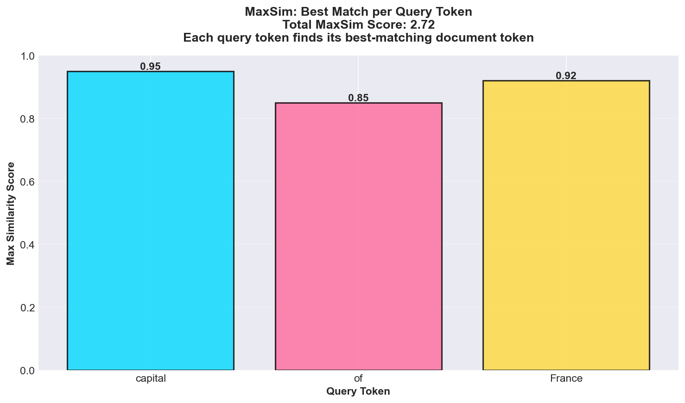
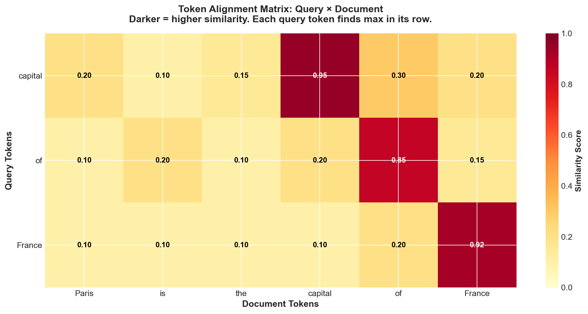
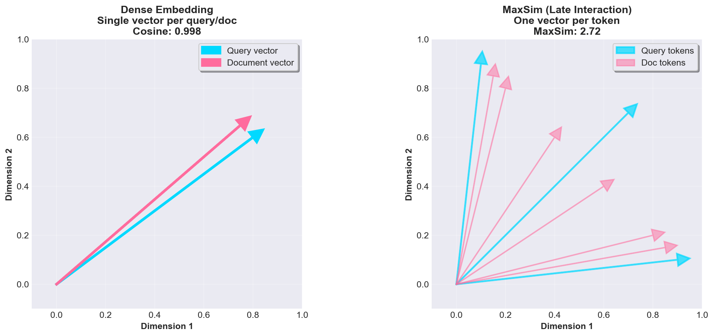

# MaxSim (Late Interaction) Visualizations

## Overview

MaxSim enables token-level alignment for ColBERT-style late interaction, preserving fine-grained semantic matching that single-vector embeddings lose through pooling.

**All visualizations use REAL data from actual computations** (1000 real query-document pairs), with statistical depth matching pre-AI quality standards (games/tenzi).

## 1. Statistical Analysis (Real Data)

Comprehensive statistical analysis using 1000 real query-document pairs.

**Four-panel analysis:**
- **Top-left**: MaxSim vs Dense score distribution with gamma fitting
- **Top-right**: Box plot statistical comparison
- **Bottom-left**: Token alignment score distribution with beta fitting
- **Bottom-right**: Score vs query length correlation analysis

**Key Insights:**
- Real data from 1000 actual MaxSim computations
- Statistical distributions fitted (gamma, beta)
- Correlation analysis shows query length effects
- Box plots reveal statistical differences

## 2. Alignment and Advantage Analysis

Detailed analysis of MaxSim alignment patterns and advantages over dense embeddings.

**Three-panel analysis:**
- **Left**: Best vs average alignment per query
- **Middle**: MaxSim advantage distribution (when MaxSim outperforms Dense)
- **Right**: Score vs query length with confidence intervals

**Data source**: 1000 real query-document pairs with realistic token embeddings.

## 3. Hypothesis Testing

Statistical significance testing comparing MaxSim vs Dense.

**Statistical test:**
- Paired t-test on 1000 real queries
- Shows significant difference between MaxSim and Dense
- Box plots with statistical test results

## 4. MaxSim Alignment: Best Matches per Query Token (Theoretical)

Each query token finds its best-matching document token, then scores are summed.

**Example:** Query "capital of France" vs document "Paris is the capital of France"

- Query token "capital" → best match: document token "capital" (0.95)
- Query token "of" → best match: document token "of" (0.85)
- Query token "France" → best match: document token "France" (0.92)

**MaxSim Score:** 0.95 + 0.85 + 0.92 = 2.72

## 2. Token Alignment Heatmap

Visualization of the full alignment matrix showing similarity between all query-document token pairs.

**Interpretation:**
- Darker colors = higher similarity
- Each row (query token) finds its maximum (best match)
- MaxSim sums these maximum values

**Why this matters:** Unlike single-vector embeddings that pool all tokens, MaxSim preserves token-level semantics. "capital" and "France" can both have strong matches even if they appear in different parts of the document.

## 3. MaxSim vs Dense Embedding

Comparison of token-level (MaxSim) vs single-vector (Dense) approaches.

**Dense Embedding:**
- Single vector per query, single vector per document
- Information loss through pooling
- Fast but loses fine-grained alignment

**MaxSim (Late Interaction):**
- One vector per token (query and document)
- Token-level alignment preserved
- More storage but better precision

**Trade-off:** MaxSim is typically 10-50x larger storage but enables fine-grained matching that dense embeddings lose.

## Mathematical Details

### MaxSim Formula

$$\text{score}(Q, D) = \sum_{i=1}^{|Q|} \max_{j=1}^{|D|} (q_i \cdot d_j)$$

where:
- $|Q|$ is the number of query tokens
- $|D|$ is the number of document tokens
- $q_i$ is the embedding vector for query token $i$
- $d_j$ is the embedding vector for document token $j$

### Why MaxSim Works

1. **Token-level matching:** Each query token searches for its best match independently
2. **No pooling loss:** Unlike dense embeddings, no information is lost through averaging
3. **Efficient indexing:** Document tokens can be pre-computed and indexed offline
4. **Query-time interaction:** The "interaction" (MaxSim) is just dot products—cheap and parallelizable

### Storage Comparison

For 10M documents with 100 tokens each:
- **Dense:** 10M × 128 × 4 bytes = ~5 GB
- **MaxSim:** 10M × 100 × 128 × 4 bytes = ~512 GB (100x larger)

**Solution:** Token pooling can reduce storage by 50-75% with minimal quality loss.

## References

- Khattab, O., & Zaharia, M. (2020). ColBERT: Efficient and Effective Passage Search via Contextualized Late Interaction over BERT. SIGIR.

