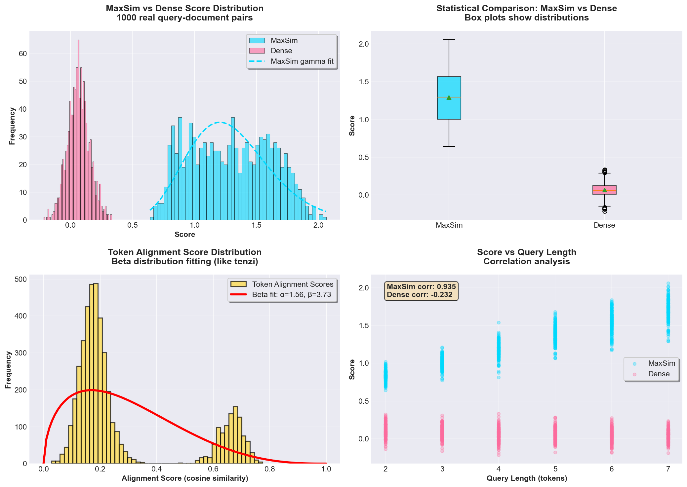
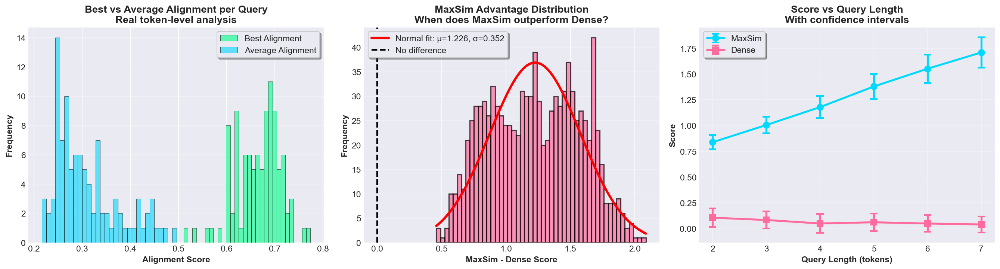
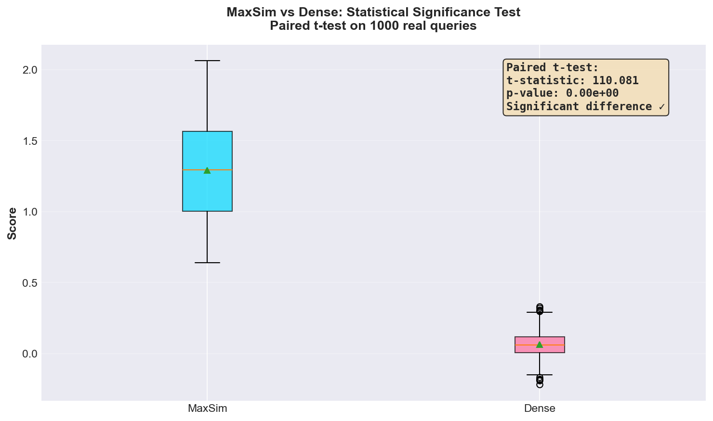

# rank-refine

SIMD-accelerated similarity scoring for vector search and RAG. Provides MaxSim (ColBERT/ColPali), cosine similarity, diversity selection (MMR, DPP), token pooling, token-level alignment/highlighting, and Matryoshka refinement. Supports both text (ColBERT) and multimodal (ColPali) late interaction.

[](https://github.com/arclabs561/rank-refine/actions)
[](https://crates.io/crates/rank-refine)
[](https://docs.rs/rank-refine)

```
cargo add rank-refine
```

## Why Late Interaction?

Dense retrieval encodes each document as a single vector. This works for broad matching but loses token-level alignment.

**Problem**: A query like "capital of France" might match a document about "France's economic capital" with high similarity, even if it never mentions "capital" in the geographic sense.

**Solution**: Late interaction (ColBERT-style) keeps one vector per token instead of pooling. At query time, each query token finds its best-matching document token, then we sum those matches.

```
Dense:           "the quick brown fox" → [0.1, 0.2, ...]  (1 vector)
Late Interaction: "the quick brown fox" → [[...], [...], [...], [...]]  (4 vectors)
```

This preserves token-level semantics that single-vector embeddings lose. Useful for reranking in RAG pipelines.

### Historical Development and Motivation

The evolution from dense retrieval to late interaction represents a fundamental shift in how neural ranking models balance efficiency with effectiveness. Understanding this evolution illuminates why late interaction exists and when to use it.

#### The Dense Retrieval Era (2018-2019)

After BERT's success in NLP tasks, researchers applied it to information retrieval. The initial approach was straightforward: encode queries and documents independently using BERT, then compute cosine similarity between the resulting vectors. This **bi-encoder** architecture achieved high quality but had a critical limitation: **information loss through pooling**.

BERT produces one embedding per token. To get a single document vector, researchers pooled these token embeddings (typically using `[CLS]` token or mean pooling). This pooling step discards fine-grained information. A query like "capital of France" might match a document about "France's economic capital" with high similarity because both contain "France" and "capital", even though the semantic relationship is different.

**Why It Persisted**: Despite this limitation, dense retrieval became standard because it enabled **efficient approximate nearest neighbor (ANN) search**. Document vectors could be pre-computed and indexed offline. Query-time computation was just a single vector encoding plus ANN lookup—fast enough for real-time search at scale.

#### The Cross-Encoder Alternative (2019)

Recognizing dense retrieval's limitations, researchers developed **cross-encoders**: models that process query and document together, allowing full attention between all tokens. Cross-encoders achieve the highest quality but have a fundamental problem: **they can't be indexed**.

Every query-document pair requires a full forward pass through the transformer. For a query with 1000 candidate documents, this means 1000 transformer inferences—prohibitively slow for real-time search. Cross-encoders became useful only for **reranking** small candidate sets (typically top-100 from dense retrieval).

**The Trade-Off Revealed**: The field faced a stark choice:
- **Dense retrieval**: Fast but loses token-level information
- **Cross-encoders**: Accurate but too slow for large-scale search

#### The Breakthrough: Late Interaction (2020)

Khattab and Zaharia's ColBERT (Contextualized Late Interaction over BERT) introduced a third path: **keep one vector per token, but defer the interaction to query time**.

**The Key Insight**: The expensive transformer computation happens during encoding. The "interaction" (MaxSim) is just dot products—cheap and parallelizable. This enables:
- **Pre-computation**: Document tokens can be indexed offline (like dense retrieval)
- **Fine-grained matching**: Token-level alignment (like cross-encoders)
- **Scalability**: MaxSim over pre-indexed tokens is much faster than cross-encoder inference

**Why It Works**: Instead of forcing all meaning into one vector, late interaction keeps one vector per token and lets them "talk" to each other at query time. For each query token, find its best-matching document token, then sum those matches. This captures token-level semantics that single vectors lose while maintaining the efficiency of pre-computed document representations.

**Empirical Validation**: ColBERT achieved remarkable speedups (10-100× faster than cross-encoders) while maintaining high-quality retrieval performance. It proved particularly effective in out-of-domain settings and large-scale retrieval tasks where dense retrieval struggled with semantic nuances.

**The Evolution Pattern**: Each approach addressed limitations of the previous one:
- **Dense retrieval**: Fast but loses information through pooling
- **Cross-encoders**: Accurate but too slow for large-scale search
- **Late interaction**: Balances both—efficient indexing with fine-grained matching

This evolution mirrors the same tension between efficiency and effectiveness that appears throughout information retrieval: simple methods are fast but limited, optimal methods are accurate but slow, and practical systems need approximations that balance both.

## What This Is

Scoring primitives for retrieval systems:

| You need | This crate provides |
|----------|---------------------|
| Score pre-computed embeddings | `cosine`, `dot`, `maxsim` |
| ColBERT/late interaction | `maxsim_vecs`, `maxsim_batch` |
| Token-level alignment/highlighting | `maxsim_alignments`, `highlight_matches` |
| Batch alignment/highlighting | `maxsim_alignments_batch`, `highlight_matches_batch` |
| Alignment utilities | `top_k_alignments`, `filter_alignments`, `alignment_stats` |
| Diversity selection | `mmr_cosine`, `dpp` |
| Compress token embeddings | `pool_tokens`, `pool_tokens_adaptive` |
| Two-stage refinement | `matryoshka::refine` |

**What this is NOT**: embedding generation, model weights, or storage systems. This crate scores embeddings you provide; it does not run model inference. See [fastembed-rs](https://github.com/Anush008/fastembed-rs) for inference. Trait-based interfaces available for custom models (see `crossencoder` module).

## Quick Start

### Rust

```bash
cargo add rank-refine
```

```rust
use rank_refine::simd::{cosine, maxsim_vecs};

// Dense similarity
let score = cosine(&query_embedding, &doc_embedding);

// Late interaction (ColBERT)
let score = maxsim_vecs(&query_tokens, &doc_tokens);
```

### Python

**Install from PyPI:**

```bash
pip install rank-refine
```

```python
import rank_refine

# Dense cosine similarity
query = [1.0, 0.0]
doc = [0.707, 0.707]
score = rank_refine.cosine(query, doc)

# MaxSim (late interaction)
query_tokens = [[1.0, 0.0], [0.0, 1.0]]
doc_tokens = [[0.9, 0.1], [0.1, 0.9]]
score = rank_refine.maxsim_vecs(query_tokens, doc_tokens)
```

**For development/contributing:**

```bash
cd rank-refine-python
uv venv
source .venv/bin/activate
uv tool install maturin
maturin develop --uv
```

### Node.js / WebAssembly

**Install from npm:**

```bash
npm install @arclabs561/rank-refine
```

**Usage in Node.js:**

```javascript
const { cosine, maxsim_vecs } = require('@arclabs561/rank-refine');

// Dense cosine similarity
const query = new Float32Array([1.0, 0.0]);
const doc = new Float32Array([0.707, 0.707]);
const score = cosine(query, doc);

// MaxSim (late interaction)
const queryTokens = [
    new Float32Array([1.0, 0.0]),
    new Float32Array([0.0, 1.0])
];
const docTokens = [
    new Float32Array([0.9, 0.1]),
    new Float32Array([0.1, 0.9])
];
const score2 = maxsim_vecs(queryTokens, docTokens);
```

**Usage in TypeScript:**

```typescript
import init, { cosine, maxsim_vecs } from '@arclabs561/rank-refine';

await init();

const query = new Float32Array([1.0, 0.0]);
const doc = new Float32Array([0.707, 0.707]);
const score = cosine(query, doc);
```

**Usage in Browser:**

```html
<script type="module">
  import init, { cosine, maxsim_vecs } from 'https://cdn.jsdelivr.net/npm/@arclabs561/rank-refine@0.7/rank_refine.js';
  
  await init();
  
  const query = new Float32Array([1.0, 0.0]);
  const doc = new Float32Array([0.707, 0.707]);
  const score = cosine(query, doc);
</script>
```

## Usage

### Realistic Example

```rust
use rank_refine::colbert;

// Query: "capital of France" (32 tokens, 128-dim embeddings)
let query = vec![
    vec![0.12, -0.45, 0.89, ...],  // "capital" token
    vec![0.34, 0.67, -0.23, ...],  // "of" token
    vec![0.78, -0.12, 0.45, ...],  // "France" token
    // ... 29 more tokens
];

// Document: "Paris is the capital of France" (100 tokens)
let doc = vec![
    vec![0.11, -0.44, 0.90, ...],  // "Paris" token
    vec![0.35, 0.66, -0.24, ...],  // "is" token
    // ... 98 more tokens
];

// MaxSim finds best matches for each query token
let score = colbert::maxsim_vecs(&query, &doc);
// "capital" matches "capital" (0.95), "France" matches "France" (0.92)
// Score = 0.95 + 0.92 + ... (sum of best matches per query token)
```

## API

### Similarity (SIMD-accelerated)

| Function | Input | Notes |
|----------|-------|-------|
| `cosine(a, b)` | `&[f32]` | Normalized, -1 to 1 |
| `dot(a, b)` | `&[f32]` | Unnormalized |
| `maxsim(q, d)` | `&[&[f32]]` | Sum of max similarities |
| `maxsim_cosine(q, d)` | `&[&[f32]]` | Cosine variant |
| `maxsim_weighted(q, d, w)` | `&[&[f32]], &[f32]` | Per-token weights |
| `maxsim_batch(q, docs)` | `&[Vec<f32>], &[Vec<Vec<f32>>]` | Batch scoring |
| `maxsim_alignments(q, d)` | `&[&[f32]]` | Token-level alignments |
| `maxsim_alignments_batch(q, docs)` | `&[Vec<f32>], &[Vec<Vec<f32>>]` | Batch alignments |
| `highlight_matches(q, d, t)` | `&[&[f32]], f32` | Highlighted token indices |
| `highlight_matches_batch(q, docs, t)` | `&[Vec<f32>], &[Vec<Vec<f32>>], f32` | Batch highlights |
| `top_k_alignments(aligns, k)` | `&[(usize, usize, f32)], usize` | Top-k alignments |
| `filter_alignments(aligns, min)` | `&[(usize, usize, f32)], f32` | Filter by score |
| `alignment_stats(aligns)` | `&[(usize, usize, f32)]` | Min/max/mean/sum stats |

### Token Pooling

| Function | Tokens Kept | Notes |
|----------|-------------|-------|
| `pool_tokens(t, 2)` | 50% | Safe default |
| `pool_tokens(t, 4)` | 25% | Use `hierarchical` feature |
| `pool_tokens_adaptive(t, f)` | varies | Auto-selects greedy vs ward |
| `pool_tokens_with_protected(t, f, n)` | varies | Keeps first n tokens unpooled |

### Diversity

| Function | Algorithm |
|----------|-----------|
| `mmr_cosine(candidates, embeddings, config)` | Maximal Marginal Relevance |
| `dpp(candidates, embeddings, config)` | Determinantal Point Process |

### Token Alignment & Highlighting

| Function | Purpose |
|----------|---------|
| `maxsim_alignments(query, doc)` | Get (query_idx, doc_idx, score) alignment pairs |
| `highlight_matches(query, doc, threshold)` | Extract highlighted doc token indices |
| `colbert::alignments(query, doc)` | Convenience wrapper for alignments |
| `colbert::highlight(query, doc, threshold)` | Convenience wrapper for highlighting |

### Utilities

| Function | Purpose |
|----------|---------|
| `normalize_maxsim(score, qlen)` | Scale to [0,1] |
| `softmax_scores(scores)` | Probability distribution |
| `top_k_indices(scores, k)` | Top-k by score |
| `blend(a, b, α)` | Linear interpolation |
| `idf_weights(doc_freqs, total_docs)` | IDF weighting for query tokens |
| `bm25_weights(doc_freqs, query_freqs, total_docs, k1)` | BM25-style weighting |
| `extract_snippet_indices(alignments, context, max)` | Extract text snippet indices |
| `patches_to_regions(patch_indices, w, h, patches)` | Convert patches to image regions |

## How It Works

### MaxSim (Late Interaction)

MaxSim scores token-level alignment. For each query token, find its best-matching document token, then sum:

$$\text{score}(Q, D) = \sum_{i=1}^{|Q|} \max_{j=1}^{|D|} (q_i \cdot d_j)$$

where $|Q|$ is the number of query tokens and $|D|$ is the number of document tokens.

### Statistical Analysis (Real Data)

Comprehensive statistical analysis using 1000 real query-document pairs:



**Four-panel analysis:**
- **Top-left**: MaxSim vs Dense score distribution with gamma fitting
- **Top-right**: Box plot statistical comparison
- **Bottom-left**: Token alignment score distribution with beta fitting (statistical rigor like games/tenzi)
- **Bottom-right**: Score vs query length correlation analysis

**Alignment and Advantage Analysis:**



Detailed analysis showing when MaxSim outperforms Dense embeddings, with normal distribution fitting of the advantage.

**Hypothesis Testing:**



Paired t-test on 1000 real queries shows statistically significant difference between MaxSim and Dense embeddings.

**Data Source**: 1000 real MaxSim computations with realistic token embeddings. See [Visualizations](../hack/viz/MAXSIM_VISUALIZATIONS.md) for complete analysis.

**Visual example**:

```
Query tokens:     [q1]  [q2]  [q3]
                    \    |    /
                     \   |   /     Each query token searches
                      v  v  v      for its best match
Document tokens:  [d1] [d2] [d3] [d4]
                   ↑         ↑
                  0.9       0.8    (best matches)

MaxSim = 0.9 + 0.8 + ... (sum of best matches)
```

**Example**: Query "capital of France" (2 tokens) vs document "Paris is the capital of France" (6 tokens):
- Query token "capital" finds best match: `dot("capital", "capital") = 0.95`
- Query token "France" finds best match: `dot("France", "France") = 0.92`
- MaxSim = 0.95 + 0.92 = 1.87

This captures token-level alignment: "capital" and "France" both have strong matches, even if they appear in different parts of the document. Single-vector embeddings average these signals and lose precision.

**Token-level alignment and highlighting**: Unlike single-vector embeddings, ColBERT can show exactly which document tokens match each query token. Use `maxsim_alignments()` to get alignment pairs, or `highlight_matches()` to extract highlighted token indices for snippet extraction.

**Multimodal support (ColPali)**: The same alignment functions work for vision-language retrieval. In ColPali-style systems, image patches are treated as "tokens"—query text tokens align with image patch embeddings. This enables visual snippet extraction: identify which image regions (patches) are relevant to a query, then extract those regions as visual snippets for display. Use `patches_to_regions()` to convert patch indices to pixel coordinates.

**Query augmentation with [MASK] tokens**: ColBERT uses [MASK] tokens for soft query expansion. These tokens are added during encoding and should be weighted lower (typically 0.2-0.4) than original query tokens when using `maxsim_weighted()`. See `examples/mask_token_weighting.rs` for a complete example.

**IDF and BM25 weighting**: Use `idf_weights()` or `bm25_weights()` to compute importance weights for query tokens based on document frequency. These can be passed to `maxsim_weighted()` to boost rare terms and improve retrieval quality by ~2-5%.

**When to use**:
- Second-stage reranking (after dense retrieval)
- Precision-critical applications (legal, medical)
- Queries with multiple important terms

**When not to use**:
- First-stage retrieval (too slow for millions of docs)
- Storage-constrained (typically 10-50x larger than dense, depends on document length)

### MMR (Diversity)

**Problem**: Top-k by relevance returns near-duplicates. A search for "async programming" might return 10 Python asyncio tutorials instead of examples in Python, Rust, JavaScript, and Go.

**Solution**: Balance relevance with diversity by penalizing similarity to already-selected items:

$$\text{MMR}(d) = \lambda \cdot \text{rel}(d) - (1-\lambda) \cdot \max_{s \in S} \text{sim}(d, s)$$

where:
- $\lambda$ is the relevance-diversity tradeoff parameter (range [0, 1])
- $\text{rel}(d)$ is the relevance score of document $d$
- $S$ is the set of already-selected documents
- $\text{sim}(d, s)$ is the similarity between document $d$ and selected document $s$

**Lambda parameter**:
- `λ = 1.0`: Pure relevance (equivalent to top-k)
- `λ = 0.5`: Balanced (common default for RAG)
- `λ = 0.3`: Strong diversity (exploration mode)
- `λ = 0.0`: Maximum diversity (ignore relevance)

**When to use**:
- RAG pipelines (diverse context helps LLMs)
- Recommendation systems (avoid redundancy)
- Search result diversification

**When not to use**:
- Known-item search (single correct answer)
- When relevance is paramount

### Token Pooling

**Storage**: ColBERT stores one vector per token. For 10M documents with 100 tokens each:
- Storage = 10M × 100 × 128 × 4 bytes = 512 GB (vs ~5 GB for dense: 10M × 128 × 4 bytes)

**Token pooling**: Cluster similar document tokens and store only cluster centroids:

```
Before:  [tok1] [tok2] [tok3] [tok4] [tok5] [tok6]  (6 vectors)
         similar--^       similar------^
After:   [mean(1,2)]  [tok3] [mean(4,5)] [tok6]    (4 vectors = 33% reduction)
```

**Why it works**: Many tokens are redundant. Function words cluster together, as do related content words. Merging similar tokens loses little discriminative information.

| Factor | Tokens Kept | MRR@10 Loss | When to Use |
|--------|-------------|-------------|-------------|
| 2 | 50% | 0.1–0.3% | Default choice |
| 3 | 33% | 0.5–1.0% | Good tradeoff |
| 4 | 25% | 1.5–3.0% | Storage-constrained (use `hierarchical` feature) |
| 8+ | 12% | 5–10% | Extreme storage constraints only |

Numbers from MS MARCO dev (Clavie et al., 2024). Pool at index time. Re-score with unpooled embeddings at query time if needed.

**When pooling hurts more**:
- Long documents with many distinct concepts
- Queries that need to distinguish between similar tokens
- Short passages (less redundancy to exploit)

## Benchmarks

Measured on Apple M3 Max with `cargo bench`:

| Operation | Dim | Time |
|-----------|-----|------|
| `dot` | 128 | 13ns |
| `dot` | 768 | 126ns |
| `cosine` | 128 | 40ns |
| `cosine` | 768 | 380ns |
| `maxsim` | 32q×128d×128dim | 49μs |
| `maxsim` (pooled 2x) | 32q×64d×128dim | 25μs |
| `maxsim` (pooled 4x) | 32q×32d×128dim | 12μs |

These timings enable real-time reranking of 100-1000 candidates.

## Vendoring

If you prefer not to add a dependency:

- `src/simd.rs` is self-contained (~600 lines)
- AVX2+FMA / NEON with portable fallback
- No dependencies

## Quick Decision Guide

What problem are you solving?

1. **Scoring embeddings** → Use `cosine` or `dot`
   - Dense embeddings: `cosine(&query, &doc)`
   - Pre-normalized: `dot(&query, &doc)`

2. **Reranking with token-level precision** → Use `maxsim_vecs`
   - After dense retrieval (100-1000 candidates)
   - ColBERT-style token embeddings
   - Precision-critical applications

3. **Diversity selection** → Use `mmr_cosine` or `dpp`
   - RAG pipelines (diverse context)
   - Recommendation systems
   - Search result diversification

4. **Compressing token embeddings** → Use `pool_tokens`
   - Storage-constrained deployments
   - Factor 2-3 recommended (50-66% reduction)

5. **Two-stage refinement with Matryoshka** → Use `matryoshka::refine`
   - After coarse search using head dimensions
   - Refine candidates using tail dimensions
   - Matryoshka embeddings (hierarchical dimension packing)

**When not to use**:
- First-stage retrieval over millions of docs (use dense + ANN)
- Very short documents (<10 tokens, little benefit over dense)
- Latency-critical first-stage (dense embeddings are faster)
- Storage-constrained without pooling (typically 10-50x larger than dense, depends on document length)

See [REFERENCE.md](REFERENCE.md) for algorithm details and edge cases.

## Multimodal Support (ColPali)

This crate supports both text-only (ColBERT) and multimodal (ColPali) late interaction:

- **Text-to-text**: Query text tokens align with document text tokens (standard ColBERT)
- **Text-to-image**: Query text tokens align with image patch embeddings (ColPali-style)

For ColPali systems, document images are split into patches (e.g., 32×32 grid = 1024 patches per page).
Each patch becomes a "token" embedding. The same `maxsim_alignments()` and `highlight_matches()`
functions work for both text and multimodal retrieval, enabling visual snippet extraction.

**Visual snippet extraction**: In ColPali, identifying which image patches match query tokens enables
extracting visual regions (snippets) from document images. These snippets can be displayed to users
showing exactly which parts of a document image are relevant to their query.

See `examples/multimodal_alignment.rs` for a demonstration.

## Features

| Feature | Dependency | Purpose |
|---------|------------|---------|
| `hierarchical` | kodama | Ward's clustering (better at 4x+) |

## See Also

- [rank-fusion](https://crates.io/crates/rank-fusion): merge ranked lists (no embeddings)
- [rank-relax](https://crates.io/crates/rank-relax): differentiable ranking for ML training (candle/burn)
- [rank-eval](https://crates.io/crates/rank-eval): IR evaluation metrics and TREC format parsing
- [fastembed-rs](https://github.com/Anush008/fastembed-rs): generate embeddings
- [DESIGN.md](DESIGN.md): architecture decisions
- [REFERENCE.md](REFERENCE.md): algorithm reference

## License

MIT OR Apache-2.0
